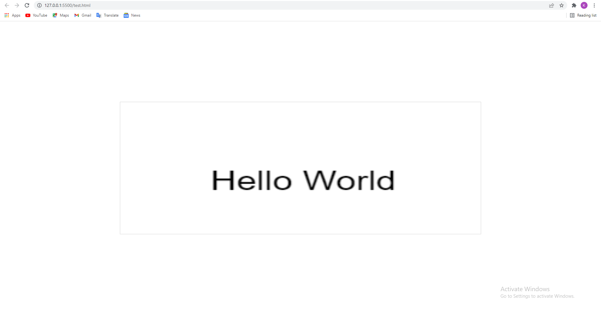

# LWWGL
<br></br>
## About
Lightweight web game library is a powerful and easy to use javascript game library for making 2D browser games

## Basic Usage

### Hello World
<br></br>
```
<!DOCTYPE html>
<html lang="en">
  <head>
    <meta charset="UTF-8" />
    <meta http-equiv="X-UA-Compatible" content="IE=edge" />
    <meta name="viewport" content="width=device-width, initial-scale=1.0" />
    <link rel="stylesheet" href="lib/VJSGL.css" />
    <script type="text/javascript" src="lib/VJSGL.js"></script>
    <title>Document</title>
  </head>
  <body>
    <canvas
      id="myCanvas"
      class="canvas-l canvas-center"        
      style="border: 1px solid #d3d3d3"
    >
      Your browser does not support the HTML canvas tag.</canvas
    >
    <script>
        let helloWorld = new FillText(75, 100, "Hello World", "Arial", 30, black);
        helloWorld.draw();
    </script>
  </body>
</html>
```
#### Result:
<br></br>
<center>  
